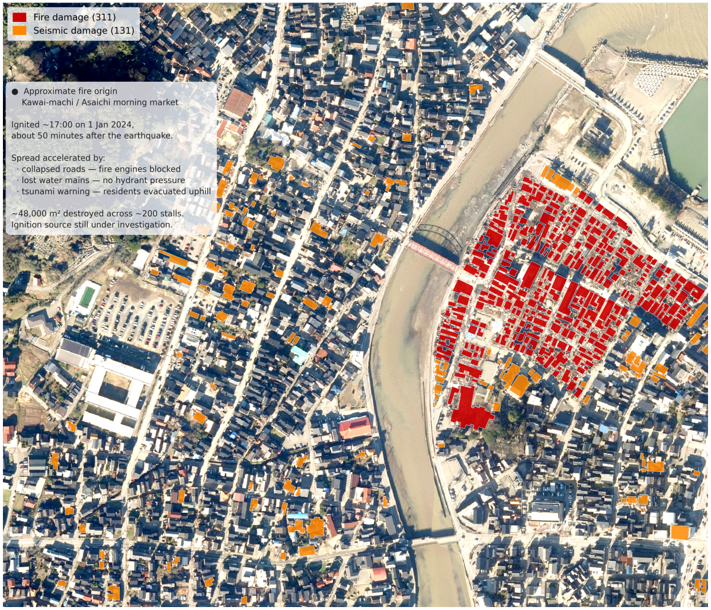
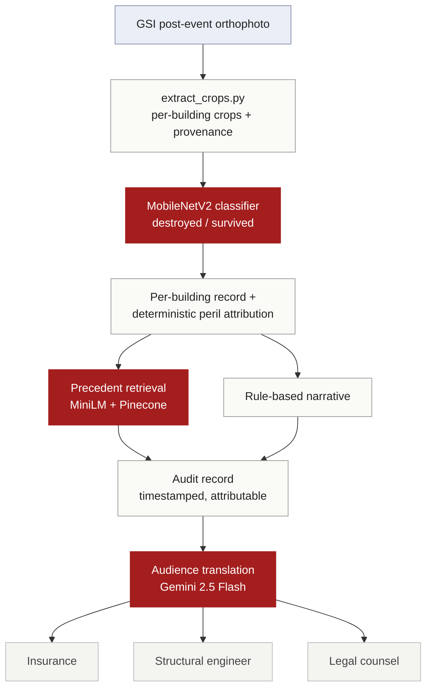

# SiteLens

[](https://sitelens.streamlit.app/)

<a href="https://sitelens.streamlit.app/">
  
</a>

<sub>Wajima Asaichi market, Noto Peninsula - per-building fire (311) and seismic (131) damage attribution. Imagery: GSI. Damage labels: Vescovo et al. 2025 (CC-BY 4.0).</sub>

> **SiteLens** turns post-event aerial imagery into per-building damage
> assessments and audience-specific inspection reports. The training data is
> self-assembled: government GSI orthophoto paired with peer-reviewed Noto
> 2024 damage labels, processed through a custom extraction pipeline (1,967
> building crops with full provenance). The demonstration handles a multi-cause
> case, the Wajima Asaichi market, where the 1 January 2024 earthquake and the
> fire it triggered destroyed buildings by different mechanisms (311 fire, 131
> seismic). The image-only classifier reaches F1 0.79 on the destroyed class
> against a leakage-free held-out test split, reported separately from the
> dataset's human ground-survey F1 of 0.94.

---

## What this project does

Given a bounding box over a damaged area, SiteLens:

1. Fetches post-event aerial orthophoto imagery for the area.
2. Classifies per-building damage (destroyed vs survived; multi-class extension planned) against ground-truth polygons.
3. Generates a structured inspection report describing damage at building and zone level.
4. Presents the result via an interactive demo.

The demonstration target is the Wajima Asaichi morning market district. On 1 January 2024, the Noto Peninsula earthquake triggered a fire in this district that destroyed approximately 200 stalls across 48,000 m². The dataset distinguishes 311 fire-damage and 131 seismic-damage buildings among 442 destroyed structures, a strong test case for multi-cause attribution.

## Status

- [x] Layer-0: GSI orthophoto fetcher (`pipeline/fetch_gsi_tiles.py`)
- [x] Layer-0: Polygon-orthophoto overlay validation (`pipeline/regenerate_multihazard.py`)
- [x] Layer-1: Per-building crop extractor (`pipeline/extract_crops.py`), 1,967 crops with provenance
- [x] Layer-1: MobileNetV2 damage classifier (`model/train.py`)
- [x] Layer-1: Held-out evaluation (`model/evaluate.py`), destroyed F1 0.79, macro F1 0.87, ROC-AUC 0.92
- [x] Layer-2: Audience-specific inspection report generator (Gemini 2.5 Flash)
- [x] Layer-3: Interactive demo, live on Streamlit Community Cloud

## Architecture



## Technical approach

SiteLens classifies per-building damage from post-event aerial imagery and generates audience-specific inspection reports.

### Data

The training set is self-assembled. GSI post-event orthophoto tiles
(Geospatial Information Authority of Japan) were georeferenced against the
peer-reviewed Vescovo et al. 2025 Noto Peninsula damage labels (Zenodo,
CC-BY 4.0) and run through a custom extraction pipeline
(`pipeline/extract_crops.py`) that produced 1,967 per-building crops, each
carrying full provenance: source polygon ID, centroid, pixel-space window,
and the git commit that generated it. Demonstration area: the Wajima Asaichi
market, where the 1 January 2024 earthquake triggered a fire, splitting 311
fire-damaged from 131 seismic-damaged buildings into a multi-cause attribution
case.

### Models

- **Damage classifier** - MobileNetV2 (ImageNet-pretrained, frozen backbone,
  retrained single-logit head). Binary destroyed/survived. `BCEWithLogitsLoss`
  with `pos_weight` derived from the training split to handle the ~3.5:1
  class imbalance. Fixed seed; held-out test split locked to file, so the same
  buildings are never seen in both training and evaluation.
- **Precedent retrieval** - `sentence-transformers/all-MiniLM-L6-v2` over a
  Pinecone vector index.
- **Report generation** - peril attribution computed deterministically in the
  pipeline, not by the LLM. Gemini 2.5 Flash translates a single canonical
  record into insurance, structural-engineering, and legal registers, and also
  produces the cross-assessment summary.

### Evaluation

Per-class metrics on a leakage-free held-out test split (n = 296),
deduplicated by building ID. Accuracy is reported but not relied on: on a
3.5:1 imbalance it is uninformative, and destroyed-class recall is what
matters for triage.

| | precision | recall | F1 |
|---|---|---|---|
| survived | 0.919 | 0.983 | 0.950 |
| destroyed | 0.918 | 0.692 | 0.789 |
| **macro** | **0.919** | **0.837** | **0.870** |

ROC-AUC 0.918.

The two F1 figures measure different things. The SiteLens model is image-only:
F1 = 0.789 on the destroyed class (0.870 macro), evaluated against a held-out
split of the Vescovo labels. The Vescovo et al. 2025 figure of 0.94 is a human
ground survey (n = 140,208), describing label quality rather than model
performance.

At the default 0.5 threshold the classifier favors precision. Moving the
threshold toward recall, where a missed destroyed building costs more than a
false alarm, is on the roadmap.

A likely driver of the missed destroyed buildings is resolution. The GSI
orthophoto is ~0.47 m/pixel, coarser than the ~0.3 m imagery (for example
WorldView-3) that collapsed-building detection work usually relies on. At this
resolution a small building reduced to rubble can occupy only a few pixels of
indistinct texture, hard to separate from intact but cluttered ground, and
smaller damaged structures are consistently harder to detect in post-earthquake
imagery (see for example https://www.mdpi.com/2075-5309/14/3/582). The 0.69
destroyed-class recall is consistent with this; confirming it with a
per-building error review is the next step.

## Dataset and attribution

This project uses two open datasets, both with full attribution preserved in derived outputs:

**Building damage labels.** Vescovo, R. et al. (2025). *Noto Peninsula 2024 earthquake building damage assessment.* Zenodo. https://doi.org/10.5281/zenodo.11055711. Licensed CC-BY 4.0. n = 140,208 buildings, F1 = 0.94 against ground survey.

**Aerial imagery.** Geospatial Information Authority of Japan (GSI). Post-event orthophoto tiles, captured 11 January 2024, ~0.47 m/pixel at zoom 18. Required attribution on derivatives: 「地理院タイル」 (Map tiles by GSI).

**Note.** The 0.94 above is human ground-survey label quality, not an image-only model score; the SiteLens model reports its own measured F1 separately (see Evaluation).

## Repository structure

```
sitelens/
├── README.md                   (this file)
├── LICENSE
├── sitelens_build_log.md       (project decisions log)
├── data/                       (data fetching and preparation)
├── notebooks/                  (exploratory work)
├── model/                      (training and evaluation)
├── pipeline/                   (end-to-end inference)
├── report/                     (LLM report generation)
└── app/                        (Streamlit demo)
```

## Context

SiteLens is the software demonstration layer of Sensing Risk, an early-stage venture building inspection-decision infrastructure for damaged building stock. This repository covers the imagery-in / structured-output-out pipeline; hardware, schema localisation, and commercial deployment sit in the venture.

## Author

Dmitrii Fedorov - computational architect transitioning to ML/CV/robotics for the built environment.

## License

MIT (see LICENSE).
