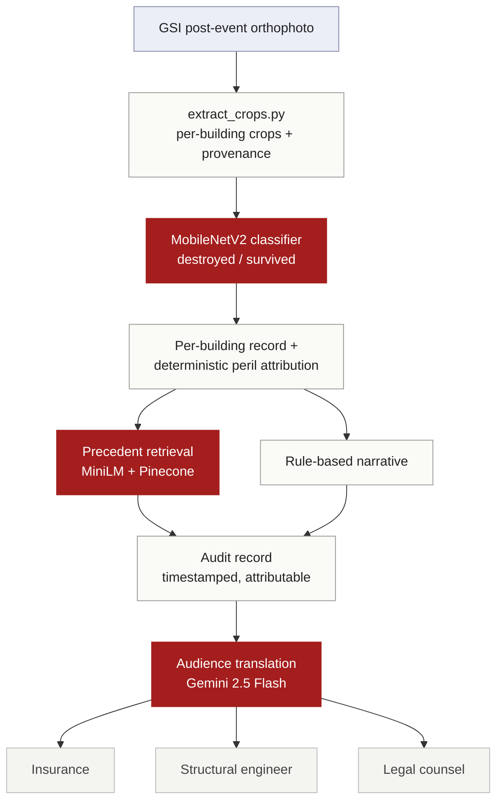

# SiteLens AI

[](https://sitelens.streamlit.app/)

[](https://sitelens.streamlit.app/)

> **SiteLens AI** turns post-event aerial imagery into per-building damage
> assessments and audience-specific inspection reports. The training data is
> self-assembled — government GSI orthophoto paired with peer-reviewed Noto
> 2024 damage labels, processed through a custom extraction pipeline (1,967
> building crops with full provenance), not a packaged dataset. The
> demonstration handles a genuine multi-cause case: the Wajima Asaichi market,
> where the 1 Jan 2024 earthquake and the fire it triggered destroyed buildings
> by different mechanisms (311 fire, 131 seismic). The image-only classifier
> reaches F1 0.79 on the destroyed class against a leakage-free held-out test
> split — reported separately from the dataset's human ground-survey F1 of
> 0.94, never conflated.

**Status:** Capstone project in active development. Developers Institute GenAI & Machine Learning Bootcamp, 2026 cohort. Target completion: 14 June 2026.

---

## What this project does

Given a bounding box over a damaged area, SiteLens AI:

1. Fetches post-event aerial orthophoto imagery for the area.
2. Classifies per-building damage (destroyed vs. survived; multi-class extension planned) against ground-truth polygons.
3. Generates a structured inspection report describing damage at building and zone level.
4. Presents the result via an interactive demo.

The demonstration target is the Wajima Asaichi morning market district. On 1 January 2024, the Noto Peninsula earthquake triggered a fire in this district that destroyed approximately 200 stalls across 48,000 m². The dataset distinguishes 311 fire-damage and 131 seismic-damage buildings among 442 destroyed structures, providing a strong test case for multi-cause attribution.

## Status

- [x] Layer-0: GSI orthophoto fetcher (`pipeline/fetch_gsi_tiles.py`)
- [x] Layer-0: Polygon–orthophoto overlay validation (`pipeline/regenerate_multihazard.py`)
- [x] Layer-1: Per-building crop extractor (`pipeline/extract_crops.py`) — 1,967 crops, full provenance
- [x] Layer-1: MobileNetV2 damage classifier (`model/train.py`)
- [x] Layer-1: Held-out evaluation (`model/evaluate.py`) — destroyed F1 0.79, macro F1 0.87, ROC-AUC 0.92
- [x] Layer-2: Audience-specific inspection report generator (Gemini 2.5 Flash)
- [x] Layer-3: Interactive demo — live on Streamlit Community Cloud

## Architecture



## Technical approach

SiteLens classifies per-building damage from post-event aerial imagery and
generates audience-specific inspection reports. The pipeline and its
evaluation are built around one discipline: every number is reported as the
kind of number it actually is.

### Data — self-assembled, not downloaded ready-made

The training set was not a packaged dataset. GSI post-event orthophoto tiles
(Geospatial Information Authority of Japan) were georeferenced against the
peer-reviewed Vescovo et al. 2025 Noto Peninsula damage labels (Zenodo,
CC-BY 4.0) and run through a custom extraction pipeline
(`pipeline/extract_crops.py`) that produced 1,967 per-building crops, each
carrying full provenance: source polygon ID, centroid, pixel-space window,
and the git commit that generated it. Demonstration area: the Wajima Asaichi
market, where the 1 Jan 2024 earthquake triggered a fire — 311 fire-damaged
against 131 seismic-damaged buildings, a genuine multi-cause attribution
problem rather than a single-hazard toy.

### Models

- **Damage classifier** — MobileNetV2 (ImageNet-pretrained, frozen backbone,
  retrained single-logit head). Binary destroyed/survived. `BCEWithLogitsLoss`
  with `pos_weight` derived from the training split to handle the ~3.5:1
  class imbalance. Fixed seed; held-out test split locked to file so the same
  buildings are never seen in both training and evaluation.
- **Precedent retrieval** — `sentence-transformers/all-MiniLM-L6-v2` over a
  Pinecone vector index.
- **Report generation** — deterministic peril attribution computed in the
  pipeline (not in the prompt), with Gemini 2.5 Flash translating a single
  canonical record into insurance, structural-engineering, and legal
  registers; distilbart-cnn-12-6 for cross-assessment summary.

### Evaluation

Per-class metrics on a leakage-free held-out test split (n = 296),
deduplicated by building ID. Accuracy is reported but not relied on — on a
3.5:1 imbalance it is uninformative; destroyed-class recall is what matters
for triage.

| | precision | recall | F1 |
|---|---|---|---|
| survived | 0.919 | 0.983 | 0.950 |
| destroyed | 0.918 | 0.692 | 0.789 |
| **macro** | **0.919** | **0.837** | **0.870** |

ROC-AUC 0.918.

**Two numbers, never conflated:**
- **SiteLens model:** image-only F1 = 0.789 (destroyed class), 0.870 (macro),
  evaluated against a held-out split of the Vescovo labels.
- **Vescovo et al. 2025 ground truth:** F1 = 0.94 — *human-on-human* ground
  survey, n = 140,208. This is the label quality, not a model score.

At the default 0.5 threshold the classifier is precision-favoring; the
decision threshold is a tunable lever toward recall where a missed destroyed
building costs more than a false alarm (roadmap, not a current claim).

## Dataset and attribution

This project uses two open datasets, both with full attribution preserved in derived outputs:

**Building damage labels.** Vescovo, R. et al. (2025). *Noto Peninsula 2024 earthquake building damage assessment.* Zenodo. https://doi.org/10.5281/zenodo.11055711. Licensed CC-BY 4.0. n = 140,208 buildings, F1 = 0.94 against ground survey.

**Aerial imagery.** Geospatial Information Authority of Japan (GSI). Post-event orthophoto tiles, captured 11 January 2024, ~0.47 m/pixel at zoom 18. Required attribution on derivatives: 「地理院タイル」 (Map tiles by GSI).

**Important framing note.** The F1 = 0.94 reported by Vescovo et al. is human ground-survey validation, not image-only model performance. The SiteLens model is image-only; it reports its own measured F1 separately, evaluated against a held-out test split of the Vescovo labels. The two numbers are not interchangeable.

## Repository structure

```
sitelens/
├── README.md                   (this file)
├── LICENSE
├── sitelens_build_log.md       (project decisions log)
├── data/                       (data fetching and preparation)
├── notebooks/                  (weekly exploratory work)
├── model/                      (training and evaluation)
├── pipeline/                   (end-to-end inference)
├── report/                     (LLM report generation)
└── app/                        (Streamlit demo)
```

## Context

SiteLens AI is the bootcamp-scoped software face of Sensing Risk, an early-stage venture building inspection-decision infrastructure for damaged building stock. SiteLens demonstrates the imagery-in / structured-output-out pipeline at a scale appropriate for a 5-week capstone window. Hardware, schema localisation, and commercial deployment are out of scope for this project.

## Author

Dmitrii Fedorov — computational architect transitioning to ML/CV/robotics for the built environment.

## License

MIT (see LICENSE).
